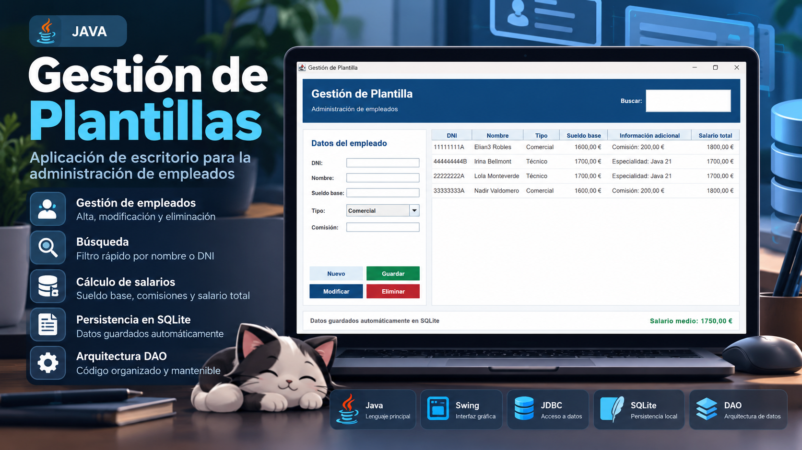
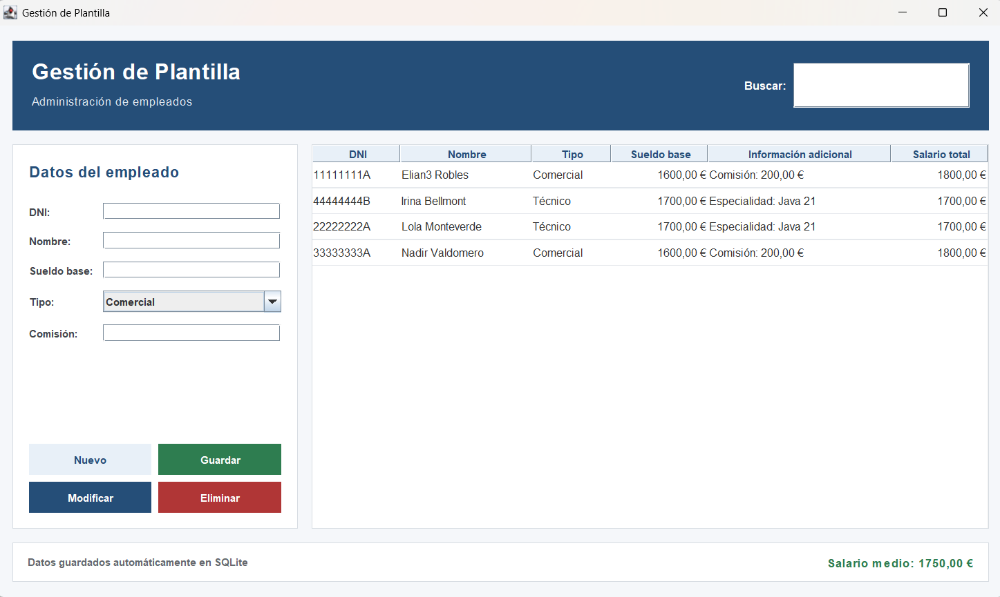

# Gestión de Plantilla



Aplicación de escritorio desarrollada con **Java 21 y Swing**, con persistencia local en **SQLite mediante JDBC** y acceso a datos separado mediante una **interfaz DAO** y su implementación `EmpleadoJdbcDAO`.

Permite administrar empleados comerciales y técnicos, consultar y modificar sus datos y calcular salarios.

## Aplicación en funcionamiento

La siguiente captura real muestra la interfaz de la aplicación; el banner superior es una imagen de presentación.



*Datos ficticios de demostración en ambas imágenes.*

La búsqueda de la interfaz filtra por nombre. Aunque el banner menciona también el DNI, la consulta por DNI está implementada en el controlador/DAO, no como filtro del buscador de la interfaz.

## Funcionalidades

- Alta, consulta, modificación y eliminación de empleados.
- Distinción entre comerciales (con comisión) y técnicos (con especialidad).
- Búsqueda de empleados por nombre.
- Cálculo del salario total y del salario medio de la plantilla.
- Validación de campos, sueldo, comisión y duplicidad del DNI.
- Persistencia local de los datos entre ejecuciones.

## Tecnologías

- Java 21
- Java Swing
- JDBC
- SQLite
- Maven

## Estructura

```text
src/gestionplantilla/
├── Empleado.java, Comercial.java, Tecnico.java  # Modelo
├── EmpleadoDAO.java, EmpleadoJdbcDAO.java       # Persistencia
├── ConexionBD.java                              # Conexión e inicialización
├── ControladorPlantilla.java                    # Lógica de aplicación
├── EmpleadoTableModel.java                      # Adaptador de tabla Swing
└── VentanaPrincipal.java                        # Interfaz gráfica y entrada
```

Las clases `PruebaFase1`, `PruebaConexionBD`, `PruebaFase2` y `PruebaControlador` son comprobaciones manuales incluidas en el desarrollo original; no constituyen una batería de pruebas automatizadas.

## Requisitos

- JDK 21
- Maven 3.9 o posterior

## Ejecución

Desde la raíz del proyecto:

```bash
mvn clean compile
mvn exec:java
```

La aplicación crea automáticamente `plantilla.db` en el directorio desde el que se ejecuta. Este archivo contiene los datos locales y no se versiona.

También puede importarse en Eclipse como proyecto Maven existente. Los archivos `.project`, `.classpath` y `.settings/` incluyen la configuración necesaria para trabajar con Java 21 y Maven en Eclipse.

## Documentación adicional

- [`MEMORIA.md`](MEMORIA.md): decisiones de diseño y alcance.
- [`GUIA_DEMOSTRACION.md`](GUIA_DEMOSTRACION.md): recorrido de demostración funcional.
